# Manoa Study Spaces

## Members
* [Chloe Whitaker](https://codovey.github.io)
* [Jonell Elizabeth Udasco](https://judasco.github.io/)
* [Tanner Tashiro](https://tanner-tashiro.github.io/)
* [Isabella Mow](https://isabellamow.github.io/)
* [Brian Kim](https://fuburian.github.io/)

## Project Links
### Team Contract
[Contract Document](https://docs.google.com/document/d/1hb_0Ur0YKB02pfjkj3bYYzVZij3YadrAdJDHP0mL67k/edit?tab=t.0)

### Github Organization
[Manoa Study Spaces](https://github.com/team-wumtk)

### Conceptual Presentation
[Canva](https://www.canva.com/design/DAHGHl5Pugc/pdYv5qV5g1zl7z_3tUgzpA/edit)

### Deployment
[Deployment](https://manoa-study-spaces.vercel.app/)

## Milestone 1
[Milestone 1 Github Project](https://github.com/orgs/manoa-study-spaces/projects/1)

## Milestone 2
[Milestone 2 Github Project](https://github.com/orgs/manoa-study-spaces/projects/3)

## Milestone 3
[Milestone 3 Github Project](https://github.com/orgs/manoa-study-spaces/projects/4)

## Overview
**The Problem**: Students at UH Manoa want to find available spaces to study, relax, or meet with their peers. Newer students may not know where to locate popular locations like libraries, lounges, and study areas. Additionally, students have different preferences for study environments; some prefer quiet spaces, others need spaces for group study, or maybe they seek specific ammenities. 

**The Solution**: This website will allow students to list different study spaces on UH Manoa Campus and their amenities. This enables students to:

* Filter noise levels (quiet vs. loud)
* Differentiate indoor and outdoor spaces
* Locate spaces with specific amenities (outlets, food, airconditioning)
* Possibly see how crowded a location is

## Approach
Manoa Study Spaces has two main user roles: students and admins.

**Admins** are responsible for moderating user-submitted content and ensuring that all study space information is accurate and up to date. They can edit or remove locations, approve new space submissions, and manage user accounts, including promoting or suspending users. Admins can also update details about existing spaces, such as amenities, noise levels, and availability, and monitor usage statistics to understand which locations are most popular and when they are busiest.

**Students** can browse and search for campus study spaces, filter them by preferences such as noise level, indoor or outdoor, or specific amenities, and save favorite locations for easy access. They can submit new spaces or report issues with existing ones, coordinate meetings with peers, and provide feedback through ratings or comments. Some features may also allow students to see occupancy indicators for certain locations, helping them choose the best spots to study or meet with others.

## User Guide
This section provides a walkthrough of the Manoa Study Spaces user interface and its capabilities.

### Signup / Login Page
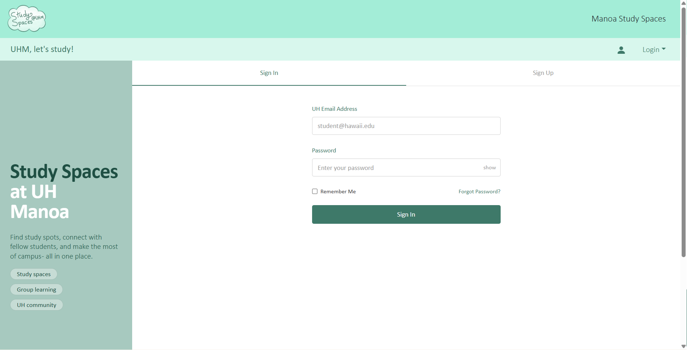
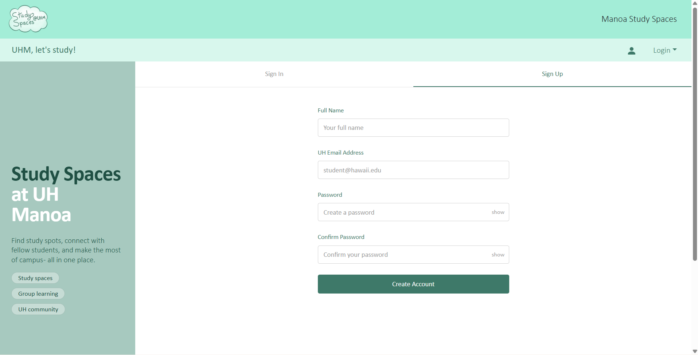

### Profile Page
The profile page will let you see and edit your profile. This page will also let you see the spaces you added, study groups you are attending, and any spaces that you bookmarked.
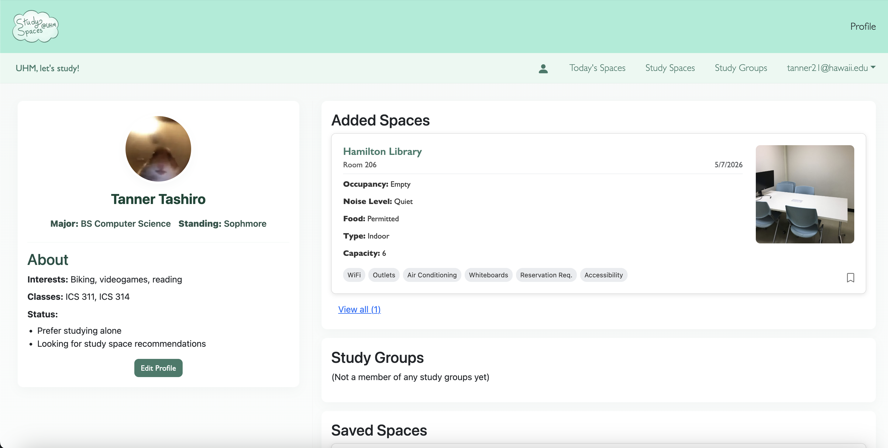
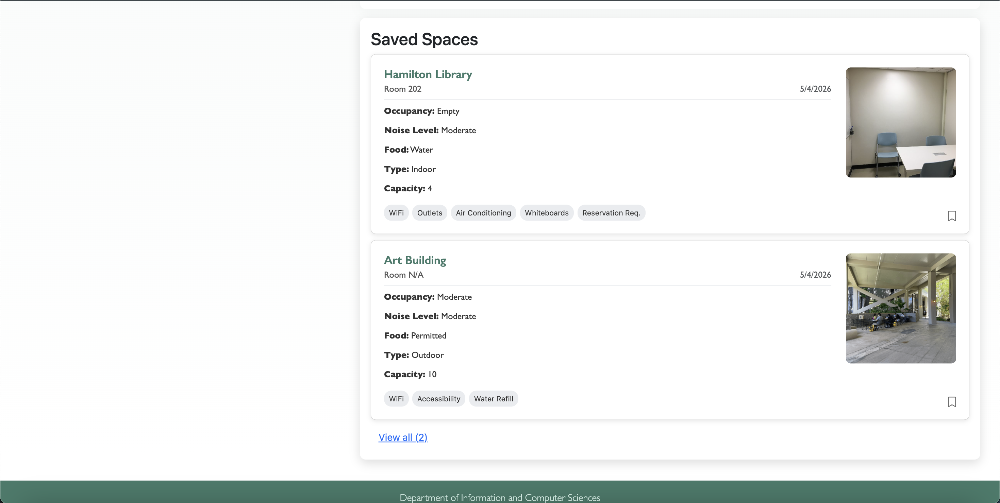

### Landing Page
The landing page is presented to users when they visit the top-level URL to the site.
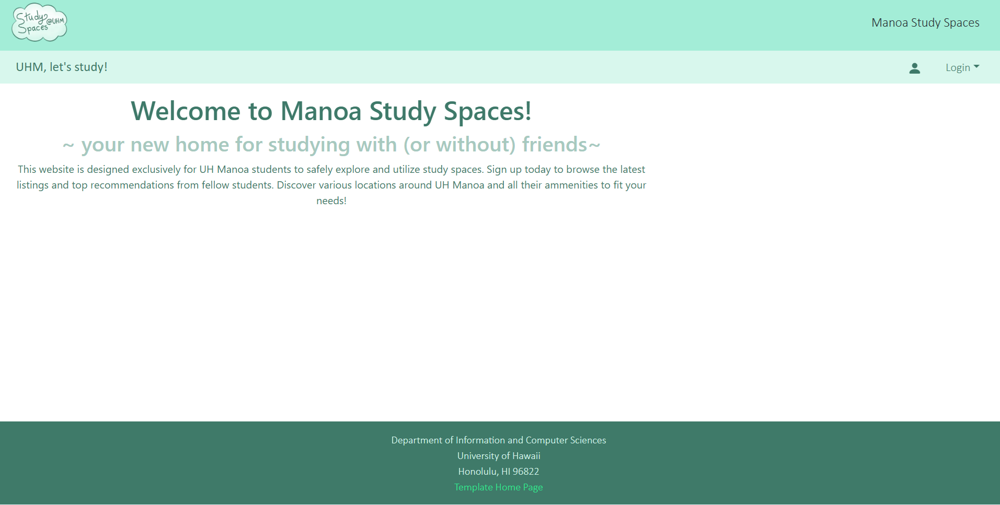

### Listing Page
Lets you see all the created spaces from the add space form.
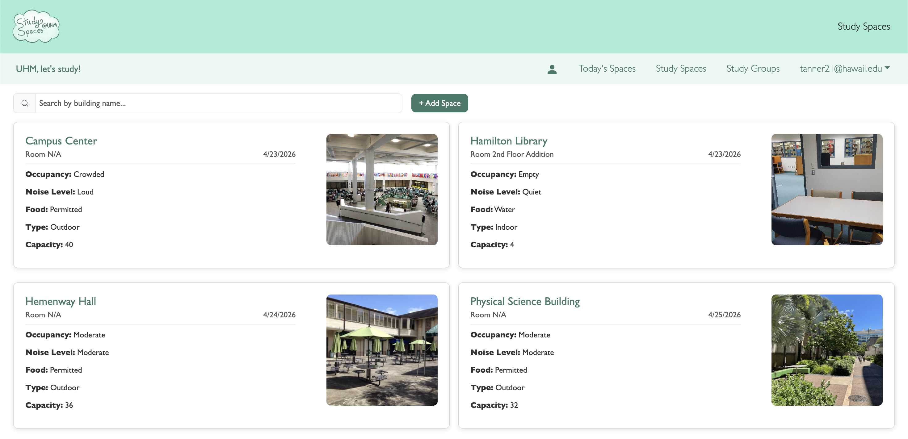

### Add Space Form
This is the form to add a space with name, image, quiet levels, capacity, etc.
You can also add amenity tags to your spaces. 
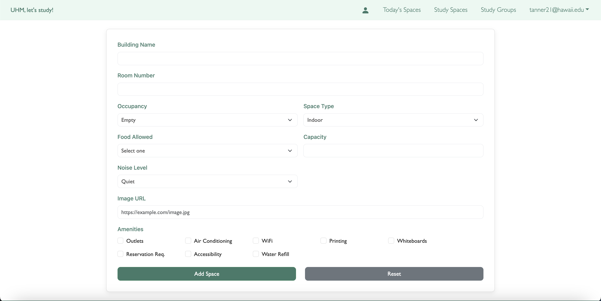

### Review Page
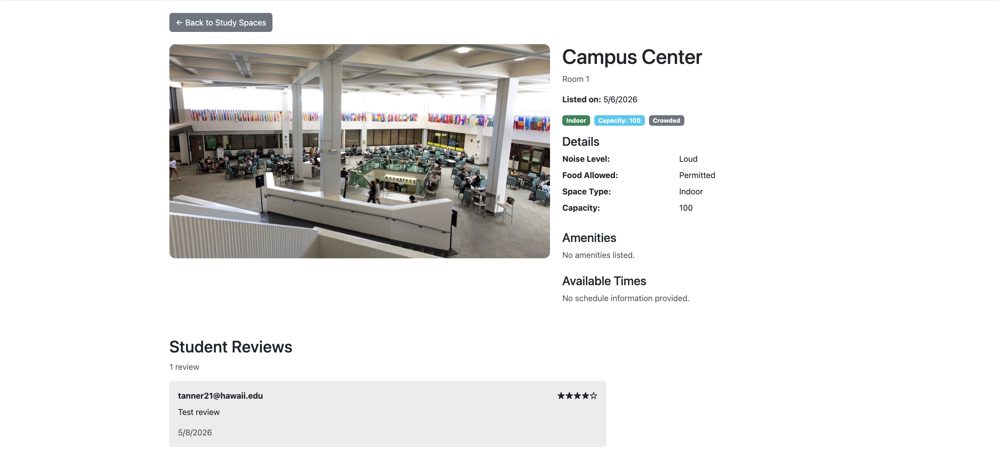
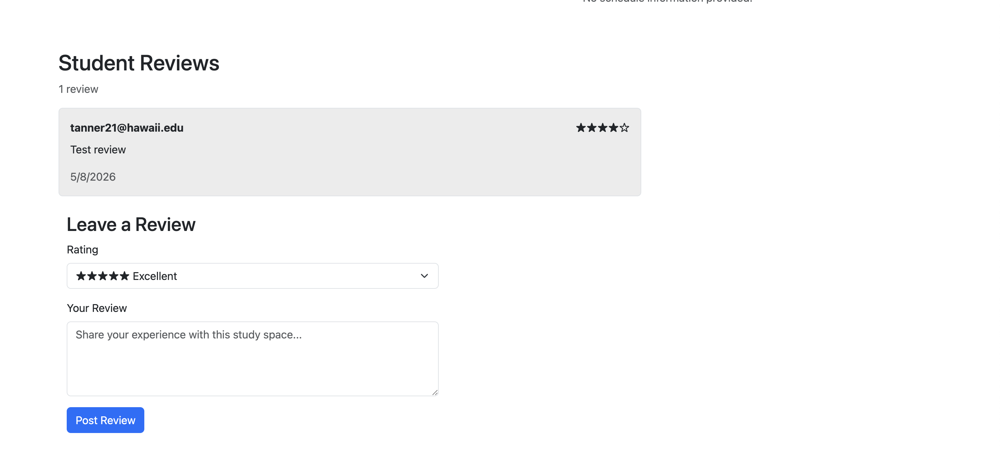

### Today's Spaces Page
Will list all the posted spaces today. 
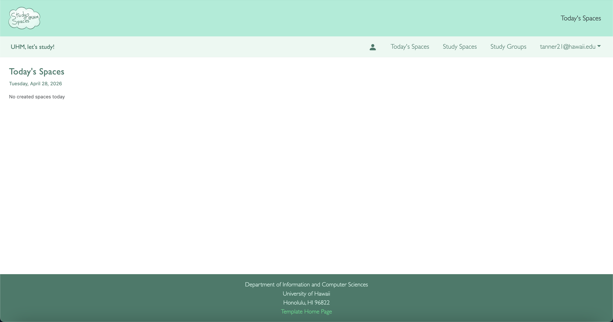

### Study Group Page
Shows all the availiable study groups with filters to see groups depending on its availability.
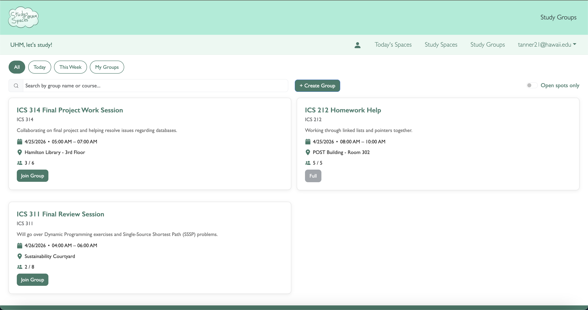

### Add Study Group Form
Here is where you create you can create your study group.
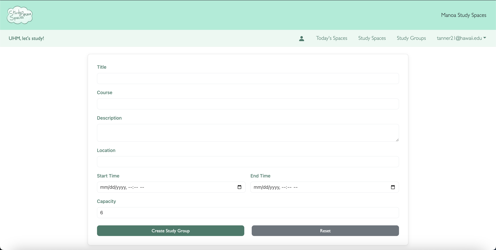

## Community Feedback
1. Maybe change color palette to darker colors and maybe add ratings/reviews to study spaces.
2. Overall the website is very nice; however, I think that the colors are a little bright and could be toned down a little bit. Also, the top navbar seems a little unnecessary since it only contains the logo and the name of the website. I think that combining the two navbars together so that the tabs are next to the logo would save space and be more efficient.
3. Bold text for the headers
4. I think the study groups section could be improved by displaying who actually made the group. Right now it is anonymous and being able to see the profile of the group maker could be helpful in determining whether a person wants to join. For the study space list section I feel like the image input could maybe take saved images or pictures that the user takes not pre-existing images online.
5. There could be more filters for the study spaces list similar to the study groups. You could add maybe filters for the amenities and for the space descriptions.

## Developer Guide
This section explains how developers can download, install, run, and modify the Manoa Study Spaces application.

### Prerequisites
Before starting, ensure you have the following installed:
* Node.js
* npm
* GitHub
* A code editor such as VS Code

### Installation
1. Clone the repository:
   ```
   git clone https://github.com/team-wumtk/manoa-study-spaces.git
   cd manoa-study-spaces
   ```
2. Install dependencies:
   ```
   npm install
   ```
   
### Running the Application
To start the development server: 
```
npm run dev
```
Then open your browser and go to http://localhost:3000, the app will automatically update when changes are made.

You can also access the website using the [vercel link](https://manoa-study-spaces.vercel.app/).


